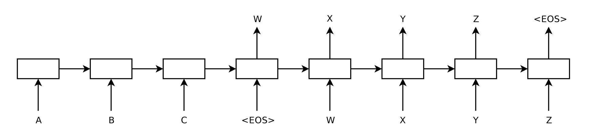
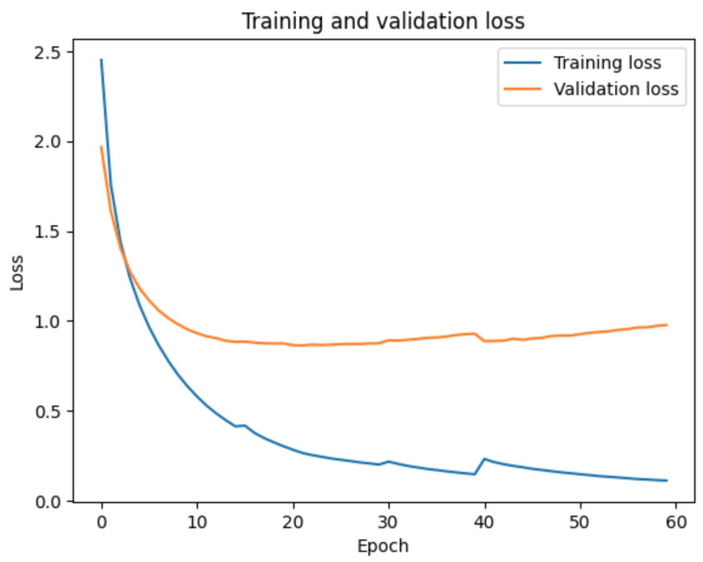

# Sequence-to-Sequence Model for Machine Translation

This repository implements an encoder-decoder model with attention for the machine translation task using the TensorFlow Spanish-to-English dataset. The model is designed and trained using the PyTorch module.

## Model Architecture

The primary components of the model include an RNN encoder and an RNN decoder. The RNN encoder comprises a word embedding layer with an embedding dimension of 128. Following the embedding, the data passes through a GRU layer with a hidden size of 128. During training, a dropout with a probability of 0.1 is applied.

The encoder's output is then fed into the attention class, implemented based on the classic Bahdanau attention mechanism, which returns the context and attention weights.

In the decoder unit, the target sentence goes through the embedding layer with a dimension of 128. The result is concatenated with the context vector from the attention unit, followed by passing through a GRU unit and a linear unit with log softmax activation to produce logits. The logits are used for word prediction.

  

  
Figure 1: Model architecture of the encoder and decoder model. Source: Sequence to Sequence Learning with Neural Networks [https://arxiv.org/pdf/1409.3215.pdf]

## Preprocessing

Both the input and target sentences are normalized to Unicode and lowercased. `<sos>` (start of sentence) and `<eos>` (end of sentence) tokens are inserted at the beginning and end of each sentence. The list of preprocessed sentences is then fitted to the `Vocab` class, creating a list of dictionaries. Each word is added to the dictionary only if its occurrence in the sentences is greater than 2. When each data batch is retrieved, sentences are padded to the same length.

## Training

For training, 50,000 sentences are used, with a train, validation, and test ratio of 0.6, 0.2, and 0.2, respectively. In Google Colab, a T4 GPU is used to speed up training. The Adam optimizer is employed with a fixed learning rate of 0.001, and the negative log-likelihood loss function is applied. 

Initial experiments with a learning rate of 0.01 showed that the validation loss quickly overshoots the minimum within the first few epochs. Different hidden state sizes/embedding sizes were also experimented (with range of 32, 64, 128, 256, 512). The results confirmed that a hidden size and embedding size of 128 yield the optimum model. The training and validation curve is shown below.

  

  
Figure 2: Training and validation loss

From the graph, we see that after 10-15 epochs, the validation loss reaches its minimum. The model parameters at epoch 13 are used for testing. The validation loss at that point is 0.742.

## Model Evaluation

After the model has been trained, both greedy search and beam search method is used to convert the logits into sentences. The test loss for the trained model is 0.809. A few samples of the outputted sentence is duplicated below.

#### Greedy search

